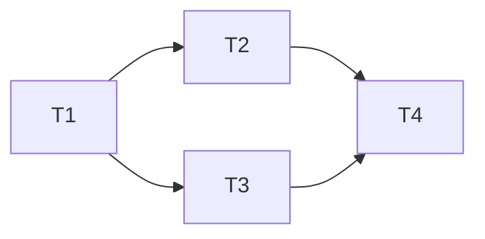

# Critical Path Method

How this project breaks features into tasks, records dependencies, finds the
critical path, and uses it to allocate rigor and parallelism. No external PM
tool: the entire system is markdown in the feature's planning folder, produced
at stage 2 of the [planning flow](process/PLANNING_FLOW.md) by the
[critical-path-planner skill](../.claude/skills/critical-path-planner/SKILL.md)
(or a human following this document).

A real example: [docs/planning/settings-file/critical-path.md](planning/settings-file/critical-path.md).

## 1. Task breakdown

- **Granularity: hours, not weeks.** Every task is 1–8 hours of focused work.
  Anything estimated above one day must be split before planning continues — big
  tasks are where hidden dependencies and hidden risk live.
- Each task has a stable ID (`T1`, `T2`, …), a one-line outcome (what is *true*
  when it's done, not what activity happens), an estimate in hours, and its
  direct dependencies.
- A task is **verifiable in isolation**: it names the test or check that proves
  it done. "Write the parser (tests in T5)" is two tasks glued together — split it
  or move the test into the task.
- Include non-code tasks (ADR, docs sync, changelog) in the graph. They take time
  and have dependencies like everything else.

## 2. Recording dependencies (the DAG)

Dependencies live in two redundant forms in `critical-path.md`, and they must agree:

**The task table** — the machine-checkable source of truth:

```markdown
| ID | Task (outcome) | Est (h) | Depends on | On CP? | Risk | Status | Owner |
|----|----------------|---------|------------|--------|------|--------|-------|
| T1 | Settings schema defined and documented | 2 | – | ✅ | Low | done | — |
| T2 | Load/save round-trips a settings file  | 4 | T1 | ✅ | Med | done | — |
```

**The Mermaid graph** — for humans, renders on GitHub:



Rules: the graph must be acyclic (a cycle means the breakdown is wrong — split a
task); `Depends on` lists only *direct* dependencies; no external tool may become
required to read or update the graph.

## 3. Identifying the critical path

The **critical path** is the dependency chain with the largest total estimate —
the floor on how fast the feature can ship no matter how many people or agents
work in parallel.

Compute it by hand (graphs here are small — if yours isn't, your tasks are too
fine or your feature too big):

1. For each task in dependency order, compute
   `earliest_finish = max(earliest_finish of deps, or 0) + estimate`.
2. The task with the largest `earliest_finish` is the end of the critical path.
3. Walk backwards from it through whichever dependency determined its start time.

Mark every task on that chain `✅` in the `On CP?` column, and keep the path
**visible at the top** of `critical-path.md` in this exact format:

```markdown
> **Critical path (10h):** T1 → T2 → T4 → T6
> Everything else can proceed in parallel with lighter review.
```

Recompute whenever estimates change materially or tasks are added/split — the
path can move, and a stale critical path silently misallocates rigor.

## 4. Risk flags

Every task gets a risk rating in the table:

- **Low** — done this exact kind of thing in this codebase before.
- **Med** — known approach, unknown details (new stdlib area, tricky edge cases).
- **High** — genuine uncertainty: unvalidated approach, external behavior we
  don't control, or a task whose failure would invalidate the design.

Rule: **a High-risk task on the critical path is the first thing built**, even
before its neighbors, usually as a spike with a throwaway branch — because if it
fails, everything downstream is waste. The planner must call this out explicitly
in the Risks section.

## 5. The rigor rule

This is why we bother computing the path at all:

| | Critical-path tasks (`[CP]`) | Off-path tasks |
|---|---|---|
| Tests | Happy path **and** error paths; edge cases enumerated in the task or spec | Happy path + obvious errors |
| Review | Line-by-line by someone (or some agent) other than the author, against spec + [Definition of Done](process/DEFINITION_OF_DONE.md) | Standard review; batching several small tasks into one review is fine |
| TODOs | Forbidden — a TODO on the critical path means the task isn't done | Allowed as `TODO(#issue):` |
| Parallelism | Serialized by the path itself; build in path order | Free to parallelize; ideal for new contributors and secondary agents |
| Scheduling | First priority whenever unblocked | Fill idle capacity |

Commit messages for critical-path tasks reference the task ID
(`Implement settings load/save (settings-file T2)`) so the trail from code back
to plan survives.

## 6. Keeping status current

The `Status` column (`todo` / `in-progress` / `done` / `dropped`) in the task
table is updated **in the same commit** as the work it describes. The
critical-path doc is a living document during stage 4 and a historical record
after — someone resuming the feature cold reads it to learn exactly what's left,
per [PLANNING_FLOW.md](process/PLANNING_FLOW.md#resuming-a-feature-with-no-context).
