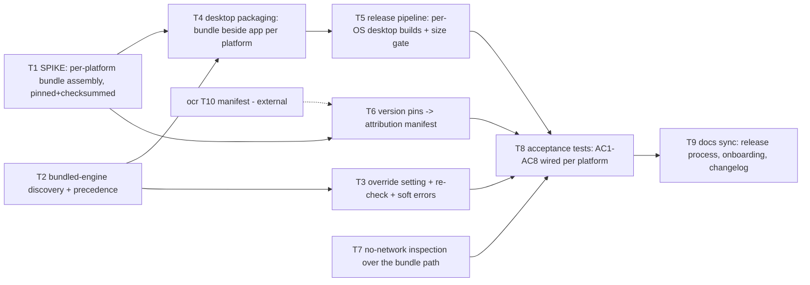

# Critical path: OCR engine bundling

- **Stage**: 2 — Critical path analysis ([method](../../CRITICAL_PATH_METHOD.md))
- **Source spec**: [spec.md](spec.md)
- **Date**: 2026-07-20
- **Status**: Stage 3 complete — APPROVED-WITH-CONDITIONS
  ([design-review.md](design-review.md)); delivery decided by
  [ADR-0015](../../architecture/ADR-0015-ocr-engine-bundling.md). **C1 gate
  open**: the T1 spike must pass on all three platforms before T4/T5.
  Stage-3 rulings folded in: sourcing policy (ADR-0015), macOS layout from
  T1 evidence (C6), CLI leaves the release artifacts (C5), settings key
  `ocrEnginePath` additive-only (C4).

> **Critical path (22h): T1 → T4 → T5 → T8 → T9**

The root risk is T1 — nobody has proven a self-contained Tesseract bundle on
macOS/Linux (Windows is proven by the ocr feature's T2 spike). It is built
FIRST as a time-boxed spike per the [rigor rule](../../CRITICAL_PATH_METHOD.md#rigor-rule);
its failure re-opens the spec's stage-3 sourcing question (and possibly the
per-platform scope), not just this plan. The discovery/override track
(T2→T3) is independent of sourcing and parallelizes fully. **External
dependency**: T6 needs the attribution manifest that the **ocr feature's
T10** creates — that task is still `todo` there and must land before T6/T8
close.

## Task graph

## Task table

| ID  | Task (outcome) | Est (h) | Depends on | On CP? | Risk | Status | Owner |
| --- | -------------- | ------- | ---------- | ------ | ---- | ------ | ----- |
| T1  | **Bundle-assembly SPIKE, per platform.** A committed script (`scripts/`) that, given pinned URLs + SHA-256 checksums, produces a self-contained `tesseract` bundle dir (engine + `nld.traineddata` + configs) on **each of windows/darwin/linux** — proven by the existing real-engine spike test passing against the produced bundle on all three OSes (scratch CI run acceptable as proof). Windows follows the T2-spike recipe (UB-Mannheim extract + trim); darwin/linux sourcing is the open question this spike answers for the stage-3 ADR. Time-box: if a platform can't be satisfied from pinned binaries, the finding (build-from-source cost, or platform deferral) goes back to stage 3 — it re-opens spec A3/platform scope, invalidating T4/T5 shape for that platform. (AC1/AC7 foundation) | 6 | – | ✅ | **High** | todo | — |
| T2  | **Bundled-engine discovery**: `tesseract.Find` gains the beside-the-executable bundle location with precedence **override > bundle > PATH** (spec A1/A2); missing/corrupt bundle degrades to the existing soft "unavailable" posture. Layout constant matches T4's packaging. (AC4, AC6) | 3 | – | – | Med | todo | — |
| T3  | **Override setting** (spec A4/A5): a settings-schema entry naming the engine executable (versioned envelope, ADR-0004 — SemVer surface), env var still winning; discovery re-checked at launch and when the setting changes (no restart); invalid override is a soft error naming the setting and the fix. (AC4, AC5) | 4 | T2 | – | Med | todo | — |
| T4  | **Desktop packaging per platform**: extend the desktop build so each platform's artifact carries the T1 bundle beside the app per the agreed layout (incl. the macOS .app answer from stage 3, spec Q2); versioned artifact naming consistent with the release process. (AC1, AC7 core) | 5 | T1, T2 | ✅ | Med | todo | — |
| T5  | **Release pipeline restructure**: release builds run **per-OS** (matrix) because the desktop shell cannot cross-compile (GTK/windowsgui/.app); artifacts = desktop app + bundle per platform; CLI's release fate per stage-3 Q3; the **size-ceiling named constant** asserted loudly at build (AC2); SHA256SUMS kept. Local `release.sh` stays the source of truth CI mirrors — one platform locally, the matrix in CI. (AC2, AC7) | 5 | T4 | ✅ | Med | todo | — |
| T6  | **Version pins → attribution manifest**: engine + model versions/licenses recorded from T1's pin file into the component/attribution manifest; the ocr feature's manifest test covers them. **External dep: ocr T10 creates that manifest.** (AC3) | 2 | T1, ocr-T10 | – | Low | todo | — |
| T7  | **No-network inspection over the bundle path** (AC8): the offline inspection covers discovery/spawn of the *bundled* engine (subprocess + bundled models only), aligned with ocr T13/C5 so the two features' inspections don't diverge. | 2 | – | – | Low | todo | — |
| T8  | **Acceptance wiring**: AC1 proven per platform in CI (real-engine tests against the packaged artifact's bundle), AC4/AC5/AC6 covered by named unit/integration tests, AC2/AC3/AC7/AC8 checks all green; spec's Covering-test column filled. | 4 | T5, T3, T6, T7 | ✅ | Med | todo | — |
| T9  | **Docs sync**: RELEASE_PROCESS.md (per-OS builds, size gate), onboarding/README ("OCR works out of the box"; the advanced override), glossary (*engine bundle*), changelog under Unreleased. | 2 | T8 | ✅ | Low | todo | — |

Path check (earliest finish): T1=6; T2=3; T3=3+4=7; T4=max(6,3)+5=11;
T5=11+5=16; T6=6+2=8 (plus the external ocr-T10, off this feature's clock);
T7=2; T8=max(16,7,8,2)+4=20; T9=20+2=**22**. Longest chain:
**T1→T4→T5→T8→T9 = 6+5+5+4+2 = 22h.** Feeders into T8: T3 (7), T6 (8),
T7 (2) all < T5 (16) → T5 binds ✔.

## Risks

- **T1 (High, on CP — built FIRST as a time-boxed spike).** macOS/Linux
  self-contained Tesseract bundles are unproven: Linux distributes tesseract
  as shared-lib packages (portable-izing needs care with `libtesseract`/
  `leptonica` deps), macOS via Homebrew (relocatability + notarization
  questions). *Mitigation*: time-box per platform; the spike's only question
  is "does the existing spike test pass against a bundle this script
  produced on this OS"; a failing platform goes back to stage 3 with the
  measured finding (build-from-source cost, or defer that platform —
  re-opening spec A3/platform scope). Windows is already proven and cannot
  fail the spike.
- **T5 (Med, on CP)**: the release workflow moves from one cross-compiling
  runner to a three-OS matrix; macOS signing/quarantine (spec Q2) can bite
  artifact launchability. *Mitigation*: dry-run the workflow from a branch
  tag before the real release; keep `release.sh` the local source of truth
  so CI stays a mirror, not a divergent build system.
- **T4 (Med, on CP)**: the macOS .app layout / Gatekeeper treatment of a
  bundled executable is stage-3 Q2. *Mitigation*: resolve Q2 at stage 3
  before T4 starts; the Windows/Linux layout ("engine dir beside the
  executable") is already exercised daily by the dev override.
- **T3 (Med)**: the settings entry is a SemVer surface (ADR-0004 envelope).
  *Mitigation*: additive schema change only; follow the settings store's
  existing versioning discipline; name it at stage 3 (spec Q4).
- **T2 (Med)**: precedence bugs would silently run the wrong engine.
  *Mitigation*: table-driven tests over all precedence combinations (the
  spec's AC4 wording is the test list).
- **External dependency (ocr T10)**: the attribution manifest does not exist
  yet. *Mitigation*: it is Low-risk and unlocked in the ocr plan — schedule
  it there before T6 needs it; T6 fails loudly (nothing to write into)
  rather than inventing a second manifest.

## Parallelization notes

- **Two tracks open immediately**: the **sourcing track** (T1 spike, the CP
  root) and the **discovery/override track** (T2→T3), which share no files —
  T2/T3 live in `src/ocr/tesseract` + `src/settings`/`src/app`, T1 in
  `scripts/` + CI. A second contributor/agent can own T2→T3 outright.
- **T7** (no-network inspection) is independent and Low — a good first task;
  coordinate wording with the ocr feature's T13 owner so the inspections
  stay aligned.
- **T6** unlocks on T1's pin file **plus the ocr feature's T10** — nudge
  that task (off-path, Low, 2h in the ocr plan) to land first.
- **T8/T9** close the feature and gate merge (Definition of Done), as usual.
