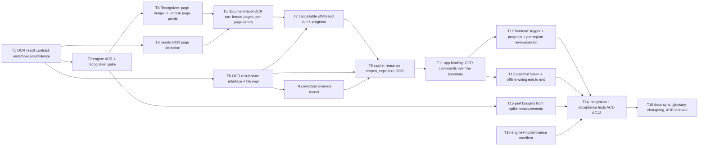

# Critical path: OCR text layer

- **Stage**: 2 — Critical path analysis ([method](../../CRITICAL_PATH_METHOD.md))
- **Source spec**: [spec.md](spec.md)
- **Date**: 2026-07-07
- **Status**: Stage 3 complete — APPROVED-WITH-CONDITIONS
  ([design-review.md](design-review.md)); OCR engine decided
  ([ADR-0014](../../architecture/ADR-0014-ocr-engine.md): Tesseract baseline).
  **C1 gate: the T2 recognition spike must pass before T4+ recognizer code
  starts.** Condition **C6 resolved — the founder chose the per-region review UI
  (T12) IN v1**, so the active critical path is the **49h** variant with T12 on
  the path.

> **Critical path (49h): T1 → T2 → T4 → T5 → T7 → T9 → T11 → T12 → T14 → T16**
> (T12 review UI is in v1 per the founder's C6 resolution.)
> The OCR-engine spike (T2) is High-risk and built first: it proves the chosen
> Tesseract integration recognizes the Dutch fixture, measures per-page latency
> and bundle size, and confirms the local-first/hardware-floor fit. If it fails,
> [ADR-0014](../../architecture/ADR-0014-ocr-engine.md) re-opens before
> downstream recognition, persistence, and UI work is wasted. Off-path tasks
> (T3 detection, T6 store, T8 corrections model, T10 license manifest, T13 error
> wiring, T15 budget) parallelize once their dep lands.

## Task graph

## Task table

| ID  | Task (outcome) | Est (h) | Depends on | On CP? | Risk | Status | Owner |
| --- | -------------- | ------- | ---------- | ------ | ---- | ------ | ----- |
| T1  | **OCR result contract** defined and documented: a `RecognizedUnit` = {text, box in **page-point** coords, confidence, engine group id} plus a page/document result shape, with the coordinate space and identity key matching the reader/`library` (spec A2, AC2, AC12). Pure types + doc, no engine. Foundation both the store (T6) and recognizer (T4) target. | 3 | – | ✅ | Med | todo | — |
| T2  | **OCR recognition spike (SPIKE).** Engine **decided** — [ADR-0014](../../architecture/ADR-0014-ocr-engine.md): Tesseract baseline (engine + Dutch `nld` model both Apache-2.0). Spike proves the chosen **Tesseract integration** (subprocess vs. cgo — measure both, pick per platform) recognizes the **Dutch fixture** page 1 **offline** to text+boxes, and **records** per-page latency, install size, and the per-platform integration path — or a documented failure that re-opens ADR-0014. (root risk; gates all recognition; design-review C1) | 8 | T1 | ✅ | **High** | todo | — |
| T3  | **Needs-OCR page detection** (spec A3, AC3): per-page heuristic — a page whose native text layer is (near-)empty but that carries a dominant image is an OCR candidate; born-digital text pages are skipped. Uses the existing `document` engine; typed result, no OCR run. | 4 | T1 | – | Med | todo | — |
| T4  | **Recognizer**: wrap the chosen engine behind an interface that takes a page image (rendered by `document` at a recognition-appropriate scale, spec A7) and returns `RecognizedUnit`s in **page-point** coordinates (pixel→point transform from the render scale + page size). Engine binding confined to this package (like PDFium in `document`). (AC1, AC2 core) | 6 | T2 | ✅ | **High** | todo | — |
| T5  | **Document-level OCR run**: iterate the candidate pages (T3) of an open document, recognizing each via T4; a page that fails is a per-page reported error, others continue (spec AC8). Returns a document OCR result. | 5 | T4, T3 | ✅ | Med | todo | — |
| T6  | **OCR result store**: narrow `Save`/`Load` of a document's OCR result keyed by document identity (`library.Identify`, path+content-hash), **file-backed**, swappable for SQLite (ADR-0008) with no interface change — mirrors `library.FileStore`. On-disk schema carries a version (SemVer surface, spec open Q4). (AC4, AC12 core) | 5 | T1 | – | Med | todo | — |
| T7  | **Cancellable, off-UI-thread run + progress**: T5 driven on a worker so the reader stays responsive; a run is cancellable mid-document, and pages already recognized are persisted via T6 (spec A8, AC7). Emits progress. | 5 | T5, T6 | ✅ | **High** | todo | — |
| T8  | **Correction override model** (spec A6, AC6): a user override for a unit's text, stored alongside the engine result (T6), taking precedence on read while the original engine text is retained/retrievable. Core model + store, no UI. | 3 | T6 | – | Med | todo | — |
| T9  | **Cache & re-OCR policy** (spec A5, AC4, AC5): a recognized document's result is reused on reopen (no re-run); re-OCR of a page is an **explicit** op replacing that page's stored result; reads apply corrections (T8) over engine text. | 4 | T7, T6, T8 | ✅ | Med | todo | — |
| T10 | **License/attribution manifest** (spec AC11, NFR-LIC-01): record the shipped OCR engine and any bundled model/weights with their licenses in the project component/attribution manifest; a test asserts the entry exists and the license is redistribution-compatible. | 2 | T2 | – | Low | todo | — |
| T11 | **App binding**: expose the OCR commands the UI needs over the `src/app` JSON boundary — detect/needs-OCR, start run (with progress/cancel), get result (units+boxes+corrections), correct a unit, re-OCR a page. JSON-serializable DTOs; no engine logic. (AC-all UI foundation) | 4 | T9 | ✅ | Med | todo | — |
| T12 | **Frontend: trigger + progress + per-region review/correction**: a "Recognize text" action, progress/cancel UI, and per-region review where a recognized unit's text is shown and correctable (spec A6, A9, AC6). Uses T11. **In v1 (C6 resolved).** Scoped per C6 guard to per-region view + inline correction — no bulk find/replace or document re-flow. | 6 | T11 | ✅ | Med | todo | — |
| T13 | **Graceful failure + offline wiring end to end**: every soft path (undetectable text, corrupt image, engine/model failure, missing store) is reported and recoverable through the binding; the reader stays up (AC8); no network anywhere in the OCR path (AC10). **Offline inspection covers the Tesseract subprocess, not just Go imports (C5).** | 4 | T11 | – | Med | todo | — |
| T14 | **Integration + acceptance tests** driving OCR of the Dutch fixture end to end for AC1–AC12, incl. the no-network inspection (AC10), license-manifest check (AC11), and the budget assertion (AC9). | 6 | T13, T12, T15, T10 | ✅ | Med | todo | — |
| T15 | **Establish per-page perf budget** from the T2 spike measurements; commit as a named constant the tests assert against (spec A8, AC9). Mirrors pdf-reader-core's budgets task. | 2 | T2 | – | Low | todo | — |
| T16 | **Docs sync**: glossary (`OCR`, `recognized unit`, `text layer`), architecture overview (new OCR component + store), changelog; engine ADR indexed. | 2 | T14 | – | Low | todo | — |

Path check (longest chain):
- **Active CP (T12 review UI in v1): T1→T2→T4→T5→T7→T9→T11→T12→T14→T16** =
  3+8+6+5+5+4+4+6+6+2 = **49h**.
- Tail into T14: T12 branch (T11→T12 = 4+6) **binds over** T13 branch
  (T11→T13 = 4+4), so the critical tail runs through **T12**.
- Feeder checks (all shorter than the binding predecessor, so none bind):
  - Into T5: T3 branch (T1→T3 = 3+4 = 7) < T4 branch (T1→T2→T4 = 3+8+6 = 17) →
    **T4 binds T5** ✔.
  - Into T7/T9: T6 branch (T1→T6 = 3+5 = 8) and T8 (T1→T6→T8 = 11) < the
    recognition chain reaching T9 (…→T7 = 31) → T6/T8 are feeders ✔.
  - Into T14: T15/T10 (T1→T2→· = 13 each) and T13 (…→T11→T13 = 41) < the CP
    reaching T14 (…→T12→T14 = 47) → feeders ✔.

## Risks

- **T2 (High, on CP — built FIRST as a time-boxed spike, per the
  [rigor rule](../../CRITICAL_PATH_METHOD.md)).** The OCR engine is the root
  technical + product risk: the field splits between a small CPU-friendly
  classical engine (Tesseract — good, not SOTA accuracy) and GB-scale VLMs
  (PaddleOCR-VL/MinerU 2.5 — SOTA accuracy but Python/PyTorch, GPU-ish, heavy
  bundle), and the choice is licensing-load-bearing (engine **and** model/weights
  must clear NFR-LIC-01). *Mitigation*: time-box the spike; prove recognition on
  the **real Dutch fixture offline** and record latency + bundle size + the
  per-platform integration path before writing T4+. *A spike failure* (chosen
  engine can't meet accuracy on the fixture, or fails the hardware-floor/license
  filter) **re-opens the engine ADR** and invalidates the recognizer approach —
  so it runs before T4, T5, T7. **This is the stage-3 ADR the
  architecture-reviewer must produce/approve before T4 starts.**
- **T4 (High, on CP)**: the pixel→page-point coordinate transform (render scale +
  page size → point boxes) is where AC2/AC12 are won or lost, and engine output
  formats vary. *Mitigation*: derive the transform from the same page-point model
  the reader already uses (`reader.PageSize`); assert boxes-inside-page on the
  fixture from the first commit; confine the engine binding to this package so a
  later engine swap doesn't ripple.
- **T7 (High, on CP)**: cancellable, off-thread OCR is where UI-responsiveness
  (AC7) is won or lost, and partial-progress persistence must not corrupt the
  store. *Mitigation*: run per-page, persist each page's result as it completes
  (T6) so cancel leaves a consistent partial result; use a context for cancel;
  never block the UI goroutine.
- **T3 (Med)**: the needs-OCR heuristic can mis-classify (a page with a thin/junk
  text layer, or a text page with a background image). *Mitigation*: per-page,
  conservative threshold; allow an explicit user force-OCR later (spec open Q6);
  test both a born-digital and the image-only fixture.
- **T6 (Med)**: the on-disk OCR schema is a near-term SemVer surface (spec open
  Q4). *Mitigation*: version the envelope from day one (as `library`/`settings`
  do); keep the interface narrow so the SQLite swap is drop-in.
- **T12 (Med, on CP — in v1 per the founder's C6 resolution)**: per-region
  review UI is the largest UI scope and now sits on the critical path.
  *Mitigation*: it is a thin frontend layer over the already-shipped correction
  **model** (T8) and binding (T11) — build those first (they de-risk T12), and
  scope T12 tightly to per-region view + inline correction (no bulk find/replace
  or re-flow, per the C6 guard). If schedule pressure appears, it remains the
  natural thing to trim to a fast-follow (CP would drop to 47h).

## Parallelization notes

- **Two tracks open after T1** (the contract): the **recognition track**
  (T2→T4→T5→T7→T9) and the **persistence track** (T6→T8), which rejoin at T9.
  A second contributor/agent can own T6+T8 (file store + correction model — Low
  shared surface with the in-flight engine work) while the first drives the T2
  spike. **T3** (detection) also unlocks at T1 and is independent of the engine.
- **T10 (license manifest)** and **T15 (perf budget)** unlock as soon as the T2
  spike lands and are Low-risk, off-path — good first tasks for a new
  contributor; neither shares files with the CP recognition tasks.
- **T12 (review UI)** is on the critical path (in v1). It remains the natural
  **deferral valve** if schedule pressure appears — cutting it to a fast-follow
  drops the CP to 47h with no AC lost except the on-screen review portion (its
  model/binding deps T8/T11 already satisfy AC6's storage behavior) — but the
  founder has chosen to ship it in v1.
- **T16 (docs)** is off-path and gates merge (Definition of Done), not other
  implementation.
