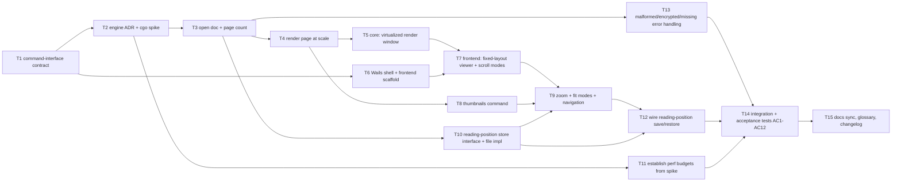

# Critical path: PDF reader core

- **Stage**: 2 — Critical path analysis ([method](../../CRITICAL_PATH_METHOD.md))
- **Source spec**: [spec.md](spec.md)
- **Date**: 2026-07-07
- **Status**: Draft — awaiting stage 3 (architecture-reviewer). **Blocked on the
  T2 engine ADR before any rendering code (T5+) starts.**

> **Critical path (41h): T2 → T3 → T4 → T5 → T7 → T9 → T12 → T14**
> The engine/cgo spike (T2) is High-risk and built first; if it fails, the
> stack decision (ADR-0005) is re-opened before downstream work is wasted.
> Off-path tasks (T6 frontend shell, T8 thumbnails, T10 persistence, T11
> budgets, T13 error-handling) parallelize once their dep lands.

## Task graph

## Task table

| ID  | Task (outcome) | Est (h) | Depends on | On CP? | Risk | Status | Owner |
| --- | -------------- | ------- | ---------- | ------ | ---- | ------ | ----- |
| T1  | Core/frontend **command-interface contract** defined and documented: typed commands `Open`, `PageCount`, `RenderPage(page,scale)`, `Thumbnails`, `GetPosition`/`SetPosition`, with request/response models and error shape. No engine yet — a Go interface + a stub impl the frontend can call. (AC-all foundation; ADR-0005 boundary) | 4 | – | – | Med | todo | — |
| T2  | **Engine decision + cgo spike (SPIKE, throwaway branch).** ADR chooses MuPDF vs PDFium on licensing (NFR-LIC-01) + capability + build cost; spike proves one page of a real PDF renders to a bitmap via cgo **and** cross-compiles for win/mac/linux via a recorded container toolchain. Outcome: ADR committed + a green build on all 3 targets, or a documented failure that re-opens ADR-0005. (R-03; gates all rendering) | 8 | T1 | ✅ | **High** | todo | — |
| T3  | Core **Document Engine: open a PDF + report page count**, wrapping the chosen engine behind the T1 interface; invalid handle is a typed error. (AC1 partial) | 4 | T2 | ✅ | Med | todo | — |
| T4  | Core **render a single page at a requested scale** to an image the frontend can display; correct dimensions per fit inputs. (AC1, AC4 core) | 5 | T3 | ✅ | Med | todo | — |
| T5  | Core **virtualized render window**: render only visible + near-visible pages; bounded rendered-page count on a 500-page fixture (not = 500). (AC3, AC11 core) | 5 | T4 | ✅ | **High** | todo | — |
| T6  | **Wails v3 desktop shell** builds and runs; frontend scaffold can invoke a stub command over the T1 boundary and show its result. (ADR-0005; AC-all UI foundation) | 6 | T1 | – | **High** | todo | — |
| T7  | **Frontend fixed-layout viewer**: renders returned page images faithfully; single-page and continuous-scroll modes over the virtualized window. (AC1, AC2, AC3) | 6 | T5, T6 | ✅ | Med | todo | — |
| T8  | **Thumbnails command + lazy panel data**: low-res page images produced lazily. (AC6 core) | 3 | T4 | – | Low | todo | — |
| T9  | **Zoom, fit-to-width/page (recompute on resize), and navigation** (next/prev clamped, go-to-page with range check, thumbnail click). (AC2, AC4, AC5, AC6) | 5 | T7, T8, T10 | ✅ | Med | todo | — |
| T10 | **Reading-position store**: narrow `Save/LoadReadingPosition` + minimal document record (identity = path + content hash), with a **file-backed** implementation behind the interface (spec A3/A4), swappable for SQLite later. (AC7, AC8 core) | 4 | T3 | – | Med | todo | — |
| T11 | **Establish numeric perf budgets** (startup NFR-PERF-03, 500-page scroll) from the T2 spike measurements; commit them as named constants the tests assert against. (AC11 gate) | 2 | T2 | – | Low | todo | — |
| T12 | **Wire reading-position save on close/navigate + restore on open**; never-opened doc opens at page 1. (AC7, AC8) | 3 | T9, T10 | ✅ | Med | todo | — |
| T13 | **Graceful error handling**: corrupt/truncated PDF, non-PDF, missing file, password-protected — each a distinct user-facing error, app stays up. (AC9, AC10) | 4 | T3 | – | Med | todo | — |
| T14 | **Integration + acceptance tests** driving the built app for AC1–AC12, incl. the no-network inspection (AC12) and budget assertions (AC11). | 6 | T12, T13, T11 | ✅ | Med | todo | — |
| T15 | **Docs sync**: architecture overview (real components replace scaffold), glossary, changelog; engine ADR indexed. | 2 | T14 | – | Low | todo | — |

Path check (longest chain):
- T2→T3→T4→T5→T7→T9→T12→T14 = 8+4+5+5+6+5+3+6 = **41h** (via T1 head +4 = 45h wall, but T1 feeds both branches; CP measured from the binding chain).
- T1→T2→T3→T4→T5→T7→T9→T12→T14→T15 = 4+8+4+5+5+6+5+3+6+2 = **48h** full chain incl. head+tail.
- Competing: T1→T6→T7→… = 4+6+6+… shorter into T7 than the T5 branch (4+8+4+5+5=26 vs 4+6=10), so T5 binds T7. ✔
- Longest end-to-end = T1→T2→T3→T4→T5→T7→T9→T12→T14→T15 = **48h**. The
  blockquote lists the binding middle (T2→…→T14); T1 (head) and T15 (docs tail)
  bracket it.

## Risks

- **T2 (High, on CP — built FIRST as a throwaway spike, per the
  [rigor rule](../../CRITICAL_PATH_METHOD.md)).** The PDF engine + cgo path is
  the root technical risk (R-03): it removes the single-static-binary property
  and needs a C toolchain + container cross-compilation for three OSes, and the
  engine choice is licensing-load-bearing (MuPDF is AGPL/commercial; PDFium is
  BSD — NFR-LIC-01). *Mitigation*: time-box the spike; prove render + tri-target
  build before writing any real rendering code. *A spike failure invalidates*
  the rendering approach and re-opens ADR-0005 (fallback stack) — so it runs
  before T3–T5, T7, T13 are touched. **This is the stage-3 ADR the
  architecture-reviewer must produce/approve before T3 starts.**
- **T5 (High, on CP)**: virtualized rendering is where scroll performance
  (AC11) is won or lost, and it interacts with engine threading/caching.
  *Mitigation*: build against the 500-page fixture from the start; cache
  rendered pages with an LRU bounded by the budget from T11; degrade overlays
  before core interaction (spec).
- **T6 (High, off-path but foundational)**: Wails v3 is newer; desktop
  packaging maturity is a stated stack assumption. *Mitigation*: stand up the
  shell early (it only depends on T1), in parallel with the T2 spike, so any
  Wails surprise surfaces alongside the engine risk, not after.
- **T10 (Med)**: document identity by path+content-hash must be stable across
  moves; hashing a large file must not block open. *Mitigation*: hash lazily /
  incrementally; position restore is a soft failure (open still succeeds).
- **T13 (Med)**: engines vary in how they signal a bad/encrypted file.
  *Mitigation*: normalize all engine failure modes into the typed error shape
  defined in T1; test with a corpus of deliberately broken fixtures.

## Parallelization notes

- **Two independent tracks open after T1** (the contract): the **core/engine
  track** (T2→T3→T4→T5) and the **frontend shell track** (T6). They only
  rejoin at T7. A second contributor/agent can own T6 while the first drives the
  T2 spike — and both High risks then surface concurrently.
- **T8 (thumbnails)**, **T10 (persistence)**, **T11 (budgets)**, and **T13
  (errors)** are off-path and unlock as soon as their single dependency lands
  (T4 or T3 or T2). T8, T10, T13 are Low/Med risk with no shared files with the
  in-flight CP rendering tasks — **good candidates for a new contributor or a
  secondary agent**.
- **T15 (docs)** is off-path and gates merge (Definition of Done), not other
  implementation.
