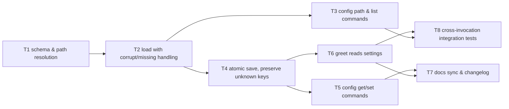

# Critical path: Local settings file

- **Stage**: 2 — Critical path analysis ([method](../../CRITICAL_PATH_METHOD.md))
- **Source spec**: [spec.md](spec.md)
- **Date**: 2026-07-07
- **Status**: Complete — all tasks done (v0.1.0)

> **Critical path (11h): T1 → T2 → T4 → T6 → T8**
> T3, T5, T7 can proceed in parallel with lighter review.

## Task graph

## Task table

| ID | Task (outcome)                                                                                                                            | Est (h) | Depends on | On CP? | Risk           | Status | Owner |
| -- | ----------------------------------------------------------------------------------------------------------------------------------------- | ------- | ---------- | ------ | -------------- | ------ | ----- |
| T1 | `settings` package exists: defaults map, `Path()` resolves per-OS config dir, overridable for tests; doc comment states failure modes | 2       | –         | ✅     | Med            | done   | —    |
| T2 | `Load()` returns defaults on missing file, effective settings on valid file, and a path-naming error on corrupt file (AC2, AC6-unit)    | 2       | T1         | ✅     | Low            | done   | —    |
| T3 | `config path` and `config list` CLI commands (AC4, AC5)                                                                               | 1       | T2         | –     | Low            | done   | —    |
| T4 | `Save()`/`Set()` write atomically via temp-file+rename and preserve unknown keys (AC7, AC8)                                           | 3       | T2         | ✅     | **High** | done   | —    |
| T5 | `config get` / `config set` CLI commands with exit codes per spec (AC3)                                                               | 1       | T4         | –     | Low            | done   | —    |
| T6 | Greet command reads`greeting` from settings; `--greeting` flag still overrides (AC1-unit)                                             | 2       | T4         | ✅     | Low            | done   | —    |
| T7 | README quick start + glossary + changelog updated                                                                                         | 1       | T5, T6     | –     | Low            | done   | —    |
| T8 | Integration tests run the**built binary** with a redirected config dir and verify AC1/AC3/AC4/AC5/AC6 end-to-end                    | 2       | T6, T3     | ✅     | Med            | done   | —    |

Path check: chains are T1→T2→T4→T6→T8 = 2+2+3+2+2 = **11h**;
T1→T2→T4→T5→T7 = 9h; T1→T2→T3→T8 = 7h. Longest = 11h. ✔

## Risks

- **T4 (High, on CP — built first after its deps, per the
  [rigor rule](../../CRITICAL_PATH_METHOD.md#rigor-rule))**: atomic rename
  semantics differ across OSes — `os.Rename` onto an existing file fails on
  some Windows configurations. *Mitigation*: same-directory temp file (rename
  never crosses filesystems); explicit Windows behavior test in CI matrix; if
  rename-over-existing fails on Windows, fall back documented in code
  (remove-then-rename with the temp file still intact on failure).
  *Spike result 2026-07-07*: `os.Rename` over an existing file succeeds on
  Windows since Go 1.5 (MoveFileEx with REPLACE_EXISTING); no fallback needed;
  risk retired.
- **T1 (Med)**: `os.UserConfigDir()` can fail (unset `$HOME`/`%AppData%`).
  Treated as a user/environment error surfaced with remediation text, not a
  panic. Tests must not depend on the real user config dir → env-var override
  designed in from the start (`APP_CONFIG_DIR`, also useful for portable mode).
- **T8 (Med)**: integration tests must build the binary; keep them `go test`-native
  (build once in `TestMain`) so `go test ./...` remains the single entry point.

## Parallelization notes

After T2 lands, T3 (off-path) is independent of the T4 chain — a second
contributor/agent could take it. T7 is deliberately off-path: docs sync gates
merge (Definition of Done) but not other implementation tasks.
