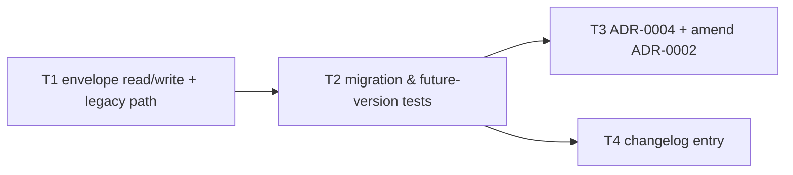

# Critical path: Settings file schema version

- **Stage**: 2 — Critical path analysis ([method](../../CRITICAL_PATH_METHOD.md))
- **Source spec**: [spec.md](spec.md)
- **Date**: 2026-07-07
- **Status**: Complete — all tasks done (Unreleased)

> **Critical path (4h): T1 → T2 → T3**
> T4 runs in parallel with T3.

## Task graph

## Task table

| ID | Task (outcome) | Est (h) | Depends on | On CP? | Risk | Status | Owner |
|----|----------------|---------|------------|--------|------|--------|-------|
| T1 | Envelope written on save; legacy flat map read via fallback; future versions rejected with path-naming error (AC1–AC3 code) | 2 | – | ✅ | Low | done | — |
| T2 | Tests for migration, future-version rejection, and full regression of the settings-file suite (AC2–AC4) | 1 | T1 | ✅ | Med | done | — |
| T3 | ADR-0004 written; ADR-0002 status amended; index updated | 1 | T2 | ✅ | Low | done | — |
| T4 | Changelog entry under Unreleased | 0.5 | T2 | – | Low | done | — |

Path check: T1→T2→T3 = 2+1+1 = **4h**; T1→T2→T4 = 3.5h. ✔

## Risks

- **T2 (Med)**: the subtle case is telling *legacy* apart from *corrupt* —
  both lack a valid envelope. Mitigation: legacy fallback still requires valid
  JSON of the flat-map shape; anything else keeps the existing corrupt-file
  error. Pinned by `TestLoadCorruptFile` (unchanged) + the new migration test.
