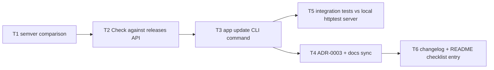

# Critical path: Update check command

- **Stage**: 2 — Critical path analysis ([method](../../CRITICAL_PATH_METHOD.md))
- **Source spec**: [spec.md](spec.md)
- **Date**: 2026-07-07
- **Status**: Complete — all tasks done (Unreleased)

> **Critical path (7h): T1 → T2 → T3 → T5**
> T4 and T6 can proceed in parallel with lighter review.

## Task graph

## Task table

| ID | Task (outcome) | Est (h) | Depends on | On CP? | Risk | Status | Owner |
|----|----------------|---------|------------|--------|------|--------|-------|
| T1 | SemVer comparison correct for numeric fields and pre-releases, unit-tested (AC6) | 1 | – | ✅ | Low | done | — |
| T2 | `update.Check()` queries the latest-release endpoint with timeout, env override, placeholder detection; all failure modes return errors, unit-tested against httptest (AC2–AC5 unit level) | 3 | T1 | ✅ | **Med** | done | — |
| T3 | `app update` command wires Check to user-facing output and exit codes (AC1–AC5 CLI level) | 1 | T2 | ✅ | Low | done | — |
| T4 | ADR-0003 recording the network-access policy decision | 1 | T3 | – | Low | done | — |
| T5 | Integration tests drive the built binary against a local httptest server (no real network in the suite) | 2 | T3 | ✅ | Med | done | — |
| T6 | Changelog entry; README new-project checklist gains the Repo slug step | 1 | T4 | – | Low | done | — |

Path check: T1→T2→T3→T5 = 1+3+1+2 = **7h**; T1→T2→T3→T4→T6 = 7h — tie;
T5 chain designated critical (test rigor outranks docs on tie-break: a doc
slip is recoverable post-merge, an untested network path is not). ✔

## Risks

- **T2 (Med, on CP)**: the GitHub API contract (shape of `tag_name`,
  `html_url`; 404 for repos with no releases). *Mitigation*: parse only those
  two fields; treat every non-200 and every parse failure as an ordinary
  failed-check error (spec: never a wrong answer); endpoint override makes the
  contract testable without the network.
- **T5 (Med)**: integration tests must not hit the real network or the test
  suite becomes flaky/offline-hostile. *Mitigation*: `APP_UPDATE_URL` override
  (spec A4) with a local `httptest` server; the placeholder-repo case pins
  that no request is even attempted unconfigured.

## Parallelization notes

T4/T6 (docs) run parallel to T5. Nothing here touches `src/settings/`, so this
feature could have proceeded concurrently with settings work.
